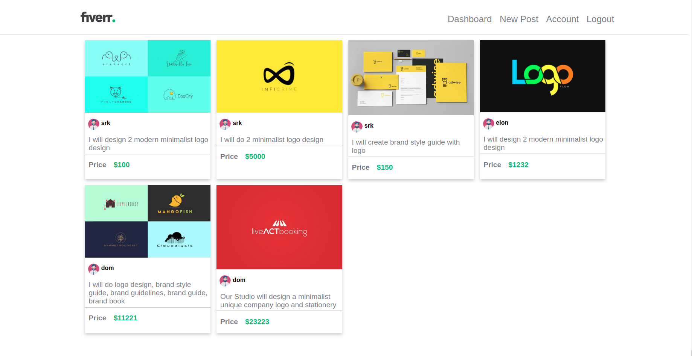
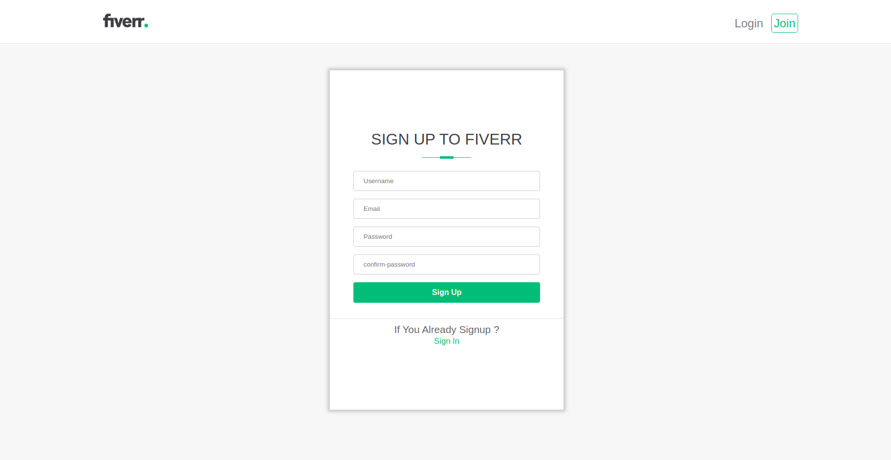
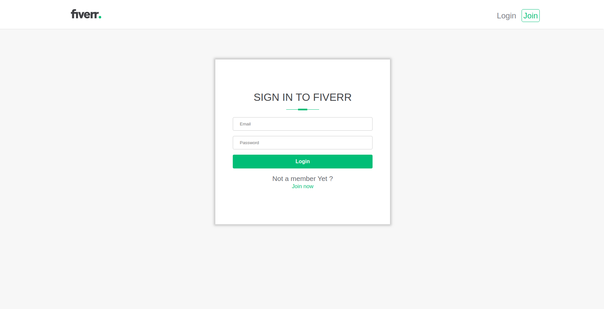
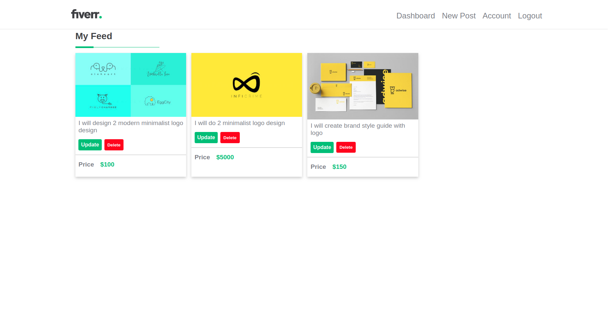
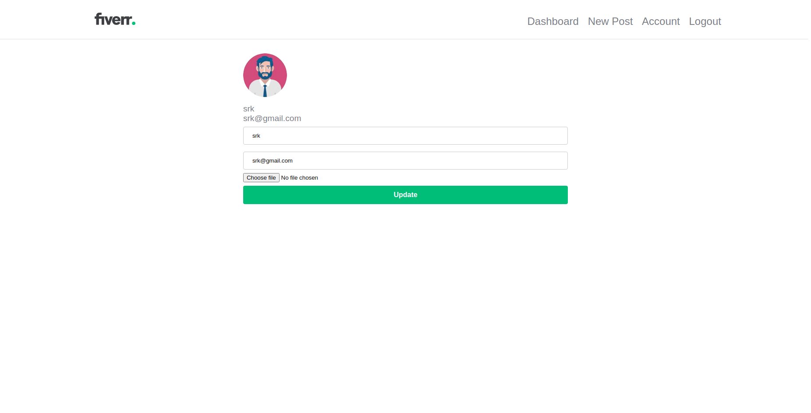
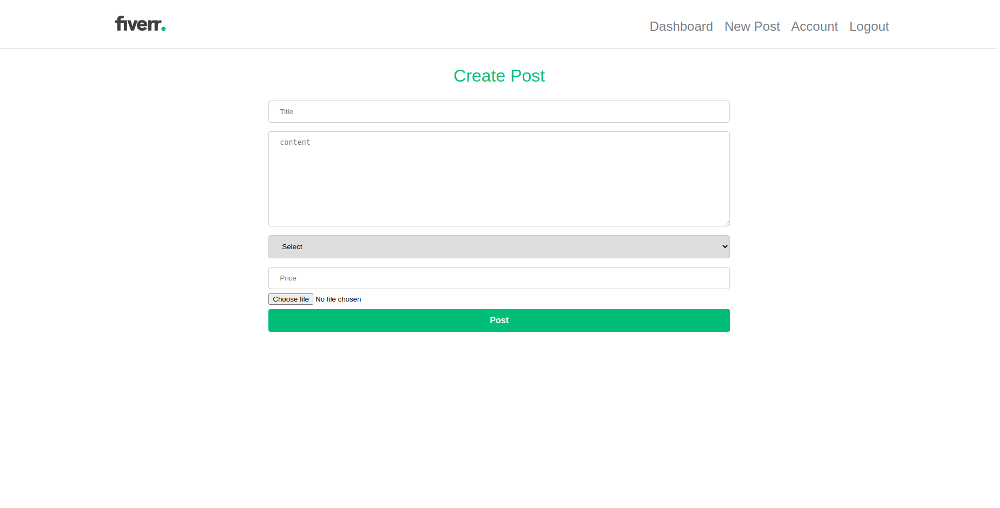
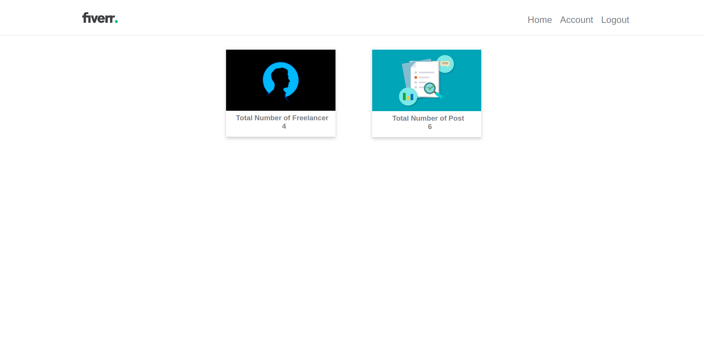
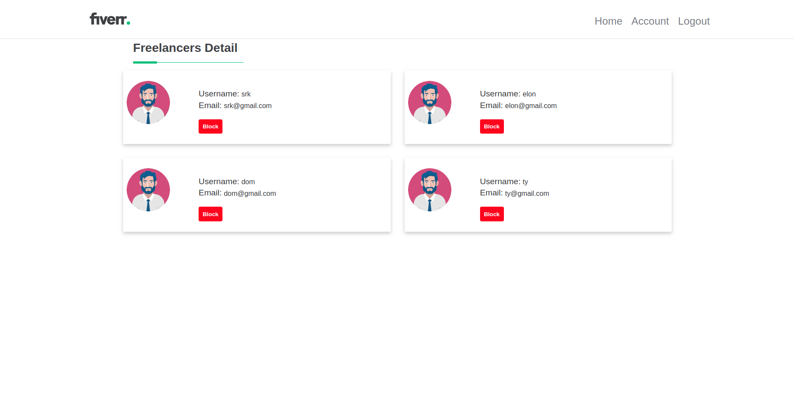

# Flask Toy Project

## Aim

You will implement the requirements which is written in the [USER-STORIES.md](https://gitlab.com/mountblue/cohort-14-python/rakshit_sarkheliya/flask-toy-project/-/blob/master/USERSTORIES.md).

## Requirements

* You have require a any browser like Chrome,Firefox,safari etc.
* Require internet connectivity.
* All requirements and dependencies run `pip3 install -r requirements.txt`

## How to run project

* Clone a repository in your system `git@gitlab.com:mountblue/cohort-14-python/rakshit_sarkheliya/flask-toy-project.git`

* You need to open postgres using this command `sudo -u postgres psql`

* Create a Role and Database in postgres using this script `\i script/createhelper.sql`

* Run command `export FLASK_APP=app.py` in the repository folder which register flaskapp.

* Run command `flask db upgrade` in the repository folder which create tables.

* Run command `flask saveadminuser` in the repository folder which create adminuser.

* Run command `flask dummyuser` in the repository folder which create dummyusers.

* Run command `flask dummypost` in the repository folder which create dummyposts.

* Run command `flask run` in the repository folder which run flask app.

* Open url [http://127.0.0.1:5000/] in Browser.

* Delete a Role and Database in postgres using this script `\i script/drophelper.sql`

### login as admin please login with:

* Email : admin@admin.com
* Password: admin

## Screenshot

1. Home Page  

2. Registration Page 

3. Login Page 

4. User Dashbord Page 

5. Account Page 

6. Create newpost Page 

   
7. Admin home Page  

8. Admin freelancerlist Page  

